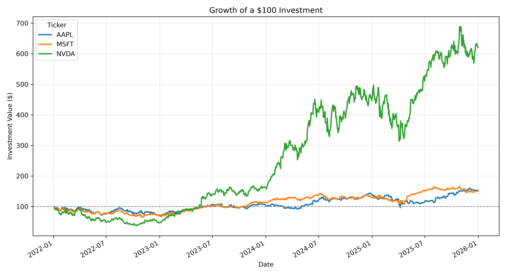

# 股票收益与风险分析报告

**分析区间：** 2022-01-03 至 2025-12-31

本报告根据项目 SQLite 数据库中的历史股价数据自动生成。

## 一、收益与风险指标

| 股票代码 | 区间累计收益率 | 年化波动率 | 夏普比率 | 最大回撤 |
|---|---:|---:|---:|---:|
| AAPL | 52.48% | 28.52% | 0.51 | -33.36% |
| MSFT | 49.32% | 26.78% | 0.51 | -35.57% |
| NVDA | 520.35% | 53.89% | 1.12 | -62.70% |

## 二、主要发现

- **区间累计收益率最高：** NVDA，累计收益率为 520.35%。
- **年化波动率最低：** MSFT，年化波动率为 26.78%。
- **夏普比率最高：** NVDA，夏普比率为 1.12。
- **历史最大回撤幅度最大：** NVDA，最大回撤为 -62.70%。

从历史结果来看，夏普比率最高的股票在承担每单位波动风险时获得了更高的收益，但较大的最大回撤也意味着投资者可能需要承受更加严重的阶段性亏损。

## 三、投资价值变化

下图假设在分析区间开始时，分别对每只股票投入100美元，并展示投资价值随时间的变化。

## 四、计算方法

- 所有收益指标均使用调整后收盘价计算。
- 区间累计收益率衡量整个分析期内的价格变化。
- 年化波动率按照每年252个交易日计算。
- 夏普比率暂时假设无风险利率为0%。
- 最大回撤衡量投资价值从历史高点到后续低点的最大跌幅。

## 五、注意事项

本报告只根据历史价格数据进行统计分析，不构成投资建议。历史表现不能保证未来收益。
